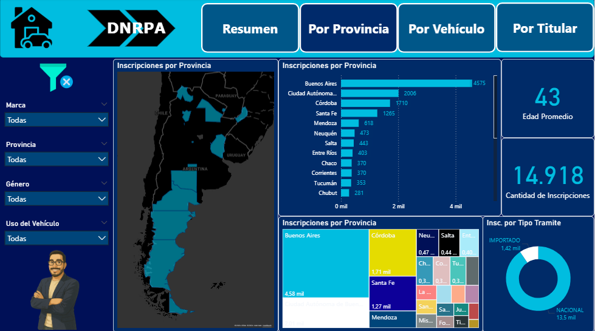
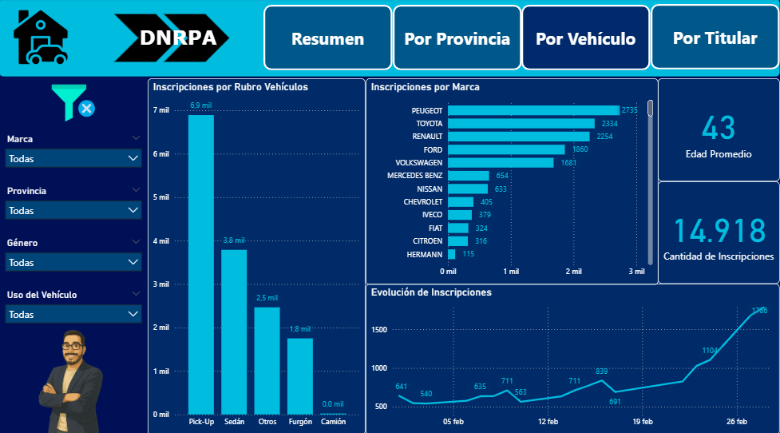
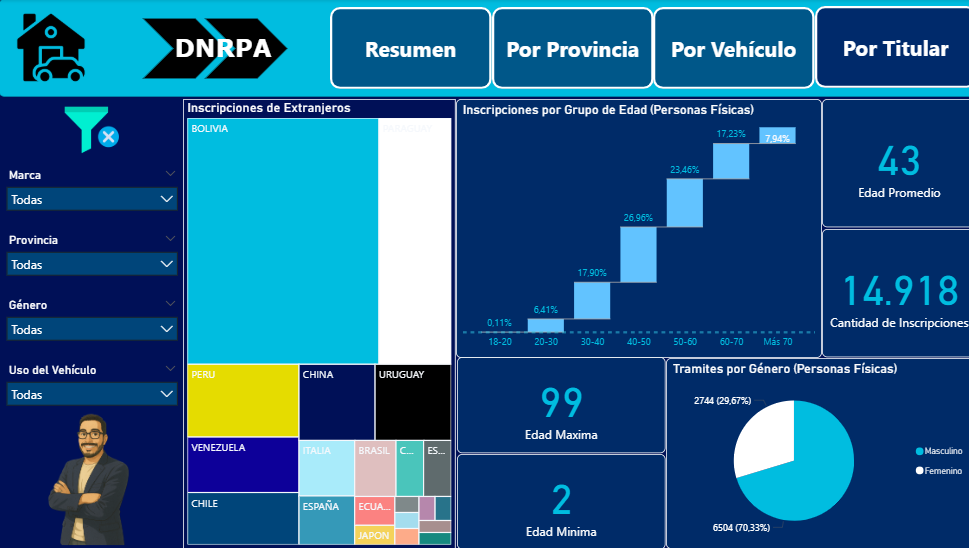

# Mi primer informe en Power BI
# 📊 Análisis de Inscripciones Iniciales de Automotores Importados en Argentina (Febrero 2023)

Este proyecto analiza el comportamiento y las características de las **inscripciones iniciales de automotores importados** en Argentina durante el mes de **febrero de 2023**. El objetivo principal es obtener insights operativos, comerciales y regulatorios que permitan mejorar la toma de decisiones en el sector automotor, tanto público como privado.

## 🎯 Objetivos

### Objetivo General

Analizar el comportamiento y las características de las inscripciones iniciales de automotores importados en Argentina para obtener insights operativos, comerciales y regulatorios.

### Objetivos Específicos

- 📍 Identificar provincias, registros y localidades con mayor volumen de inscripciones.
- 🚗 Detectar patrones según tipo de automotor, marca y modelo.
- 👤 Caracterizar demográficamente a los titulares (tipo de persona, edad, género, nacionalidad).
- 📈 Medir la evolución temporal de las inscripciones iniciales.
- 🧠 Proveer una base analítica para futuras decisiones estratégicas en el sector automotor y gubernamental.

## 🔍 Alcances del Proyecto

- Incluye **únicamente trámites realizados en febrero del año 2023**.
- El análisis es **descriptivo y exploratorio**, utilizando herramientas de **Business Intelligence (Power BI)**.
- Se trabaja con **datos estructurados y normalizados**, preservando integridad referencial entre entidades.
- **No se consideran transferencias, renovaciones ni trámites posteriores al alta inicial del vehículo.**

## 👥 Usuario Final y Nivel de Aplicación

| Rol                              | Aplicación                                         | Nivel          |
|----------------------------------|----------------------------------------------------|----------------|
| Área operativa (Registros)       | Identificar picos de carga, optimizar recursos     | Operativo      |
| Analistas del sector automotor   | Detectar tendencias de mercado                     | Táctico        |
| Entes regulatorios / Gobierno    | Formular políticas públicas, incentivos            | Estratégico    |
| Compañías automotrices / Importadores | Conocer preferencias y segmentación           | Táctico / Estratégico |

## 📂 Estructura del Tablero

### 📌 Solapa 1: Por Provincia

En esta página se visualiza la información segmentada por provincias de manera clara y rápida.

- Se destaca la **predominancia de Buenos Aires** en cuanto a cantidad de inscripciones.
- Se muestran la **edad promedio**, la **totalidad de inscripciones** y la **participación de vehículos nacionales e importados** mediante gráfico de torta.

### 🚘 Solapa 2: Por Vehículo

Esta sección permite visualizar la información segmentada por marca y rubro de vehículo.

- **Peugeot lidera** el mercado, seguido por Toyota y Renault.
- El análisis por **rubro del vehículo** muestra cómo cada marca se destaca en diferentes categorías (ej. Peugeot → Sedán).
- Al pie, un gráfico refleja la **evolución temporal** de las inscripciones, con una **tendencia creciente** hacia fin del período.

### 👤 Solapa 3: Por Titular

La última página presenta un análisis centrado en los titulares de los automotores.

- Un modelo en **cascada** muestra claramente la **distribución por grupos etarios**.
- Se incluye un filtro para **titulares extranjeros**, destacando su participación.
- En la parte inferior se agregan las **edades máxima y mínima**, y un gráfico de torta con la **distribución por género**.

## 🛠️ Herramientas Utilizadas

- **Power BI** para visualización y análisis de datos.
- **Excel / CSV** como fuente estructurada de datos.
- Transformaciones básicas con lenguaje DAX y modelado relacional.

## 📌 Notas Finales

Este tablero tiene como objetivo ser **una herramienta útil y flexible** para múltiples actores involucrados en el análisis y gestión de automotores importados en el país. 

